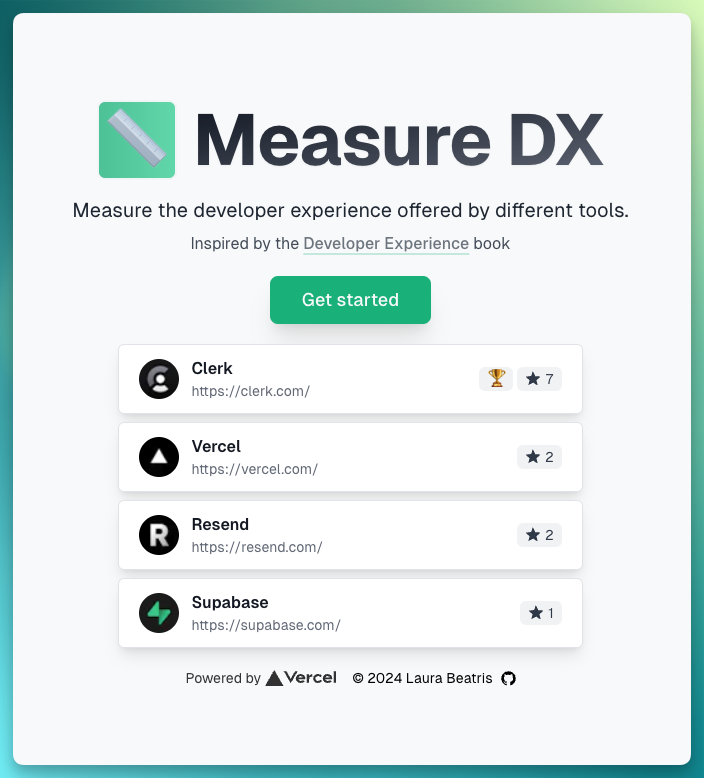

  <a href="https://measure-dx.com">
    
    <h1 align="center">Measure DX 📏</h1>
  </a>

 Measure the DX of your favorite developer tools

  
   

## How it works

There's a weekly leaderboard showcasing the developer tool with the highest rating. To participate, select your favorite tool and answer a series of questions inspired by the [Developer Experience book](https://dx.addy.ie/). Once completed, submit your responses to see how your tool ranks.

## Powered by

- [Vercel](https://vercel.com)
  - Next.js [App Router](https://nextjs.org/docs/app)
  - Next.js [Server Actions](https://nextjs.org/docs/app/api-reference/functions/server-actions)
- [Supabase](https://supabase.com/) for Postgres database

## Author

- Laura Beatris ([@lauradotjs](https://twitter.com/lauradotjs))
